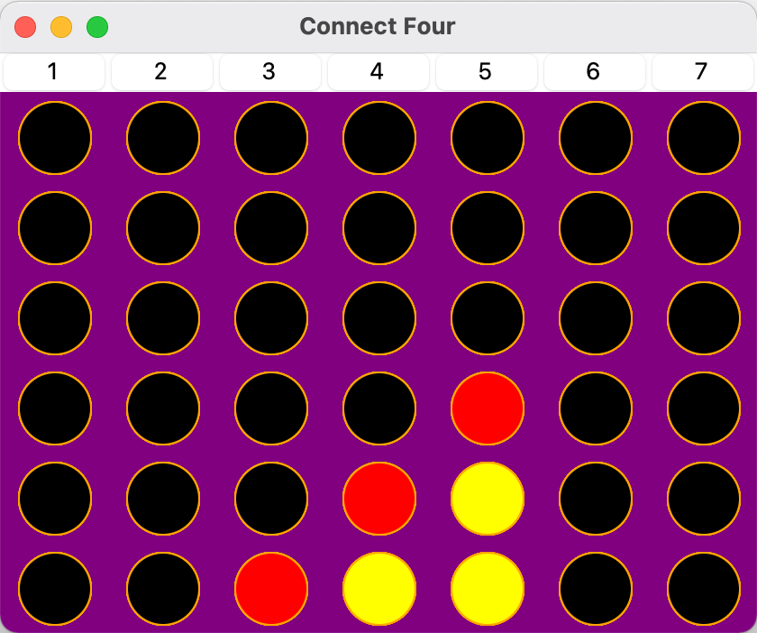

# Connect-4-with-AI-adversary

- Implementation of the classic Connect Four game where a user can play against an AI adversary
- The AI uses the MTD(f) algorithm in order to compute one of the best moves available

